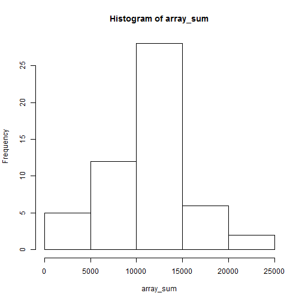

Peer Assessment 1
=================

Load the data:

```r
data <- read.csv("activity.csv")
array_sum <- tapply(data$steps, data$date, sum)
```

A histogram of the total number of steps taken each day:
 

The mean and median total number of steps taken per day:

```r
mean <- mean(array_sum, na.rm = TRUE)
median <- median(array_sum, na.rm = TRUE)
```

A time series plot of the 5-minute interval (x-axis) and the average number of steps taken, averaged across all days (y-axis):
 

Which 5-minute interval, on average across all the days in the dataset, contains the maximum number of steps?

```r
max_value <- rownames(which(array_avg == max(array_avg), arr.ind = TRUE))
```

The total number of missing values in the dataset (i.e. the total number of rows with NAs):

```r
missing_total <- sum(complete.cases(data) == FALSE)
```

A strategy for filling in all of the missing values in the dataset:
I would use the mean for that 5-minute interval. 

Create a new dataset that is equal to the original dataset but with the missing data filled in:

```r
missed_val_pos <- which(is.na(data[,1]))
data[missed_val_pos,1] <- mean(data$steps, na.rm = TRUE)
```

A histogram of the total number of steps taken each day:
 

The mean and median total number of steps taken per day:

```r
mean_ <- mean(array_sum_, na.rm = TRUE)
median_ <- median(array_sum_, na.rm = TRUE)
```

Do these values differ from the estimates from the first part of the assignment? What is the impact of imputing missing data on the estimates of the total daily number of steps?

```r
diff <- mean - mean_
```

Create a new factor variable in the dataset with two levels – “weekday” and “weekend” indicating whether a given date is a weekday or weekend day:

```r
Sys.setlocale(category = "LC_ALL", locale = "English")
```

```
## [1] "LC_COLLATE=English_United States.1252;LC_CTYPE=English_United States.1252;LC_MONETARY=English_United States.1252;LC_NUMERIC=C;LC_TIME=English_United States.1252"
```

```r
data[weekdays(as.Date(data$date), abbreviate = TRUE) %in% c("Mon", "Tue", "Wed", "Tue", "Fri"), "day_type"] <- "weekdays"
data[weekdays(as.Date(data$date), abbreviate = TRUE) %in% c("Sat", "Sun"), "day_type"] <- "weekends"
data$day_type <- as.factor(data$day_type)
```

A panel plot containing a time series plot of the 5-minute interval (x-axis) and the average number of steps taken, averaged across all weekday days or weekend days (y-axis):
 
